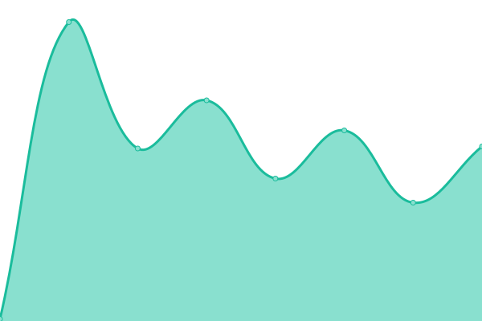
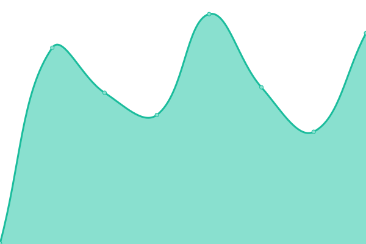
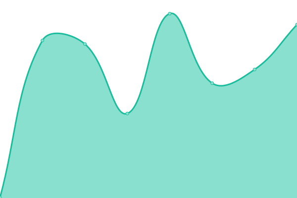

# [📈 Live Status](https://status.sanjaysoundarajan.dev): <!--live status--> **🟩 All systems operational**

This repository contains the open-source uptime monitor and status page for [Sanjay Soundarajan](sanjaysoundarajan.dev), powered by [Upptime](https://github.com/upptime/upptime).

With [Upptime](https://upptime.js.org), you can get your own unlimited and free uptime monitor and status page, powered entirely by a GitHub repository. We use [Issues](https://github.com/megasanjay/upptime/issues) as incident reports, [Actions](https://github.com/megasanjay/upptime/actions) as uptime monitors, and [Pages](https://status.sanjaysoundarajan.dev) for the status page.

<!--start: status pages-->
<!-- This summary is generated by Upptime (https://github.com/upptime/upptime) -->
<!-- Do not edit this manually, your changes will be overwritten -->
<!-- prettier-ignore -->
| URL | Status | History | Response Time | Uptime |
| --- | ------ | ------- | ------------- | ------ |
|  [Portfolio](https://sanjaysoundarajan.dev) | 🟩 Up | [portfolio.yml](https://github.com/megasanjay/upptime/commits/HEAD/history/portfolio.yml) | 

 147ms
     
 | 

<a href="https://status.sanjaysoundarajan.dev/history/portfolio">100.00%</a>
    

|  [Colorize](https://colorize.saso.one) | 🟩 Up | [colorize.yml](https://github.com/megasanjay/upptime/commits/HEAD/history/colorize.yml) | 

 180ms
     
 | 

<a href="https://status.sanjaysoundarajan.dev/history/colorize">100.00%</a>
    

|  [AI Gallery Studio](https://studio.sanjaysoundarajan.dev) | 🟩 Up | [ai-gallery-studio.yml](https://github.com/megasanjay/upptime/commits/HEAD/history/ai-gallery-studio.yml) | 

 150ms
     
 | 

<a href="https://status.sanjaysoundarajan.dev/history/ai-gallery-studio">100.00%</a>
    

|  [Umami](https://umami.sanjaysoundarajan.dev) | 🟩 Up | [umami.yml](https://github.com/megasanjay/upptime/commits/HEAD/history/umami.yml) | 

 138ms
     
 | 

<a href="https://status.sanjaysoundarajan.dev/history/umami">100.00%</a>
    

|  [Vue 3 Marquee Documentation](https://vue3marquee.sanjaysoundarajan.dev) | 🟩 Up | [vue-3-marquee-documentation.yml](https://github.com/megasanjay/upptime/commits/HEAD/history/vue-3-marquee-documentation.yml) | 

 173ms
     
 | 

<a href="https://status.sanjaysoundarajan.dev/history/vue-3-marquee-documentation">100.00%</a>
    

|  [Vue 3 Lottie Documentation](https://vue3lottie.sanjaysoundarajan.dev) | 🟩 Up | [vue-3-lottie-documentation.yml](https://github.com/megasanjay/upptime/commits/HEAD/history/vue-3-lottie-documentation.yml) | 

 130ms
     
 | 

<a href="https://status.sanjaysoundarajan.dev/history/vue-3-lottie-documentation">100.00%</a>
    

<!--end: status pages-->

[**Visit our status website →**](https://status.sanjaysoundarajan.dev)

## 📄 License

- Powered by: [Upptime](https://github.com/upptime/upptime)
- Code: [MIT](./LICENSE) © [Sanjay Soundarajan](sanjaysoundarajan.dev)
- Data in the `./history` directory: [Open Database License](https://opendatacommons.org/licenses/odbl/1-0/)
